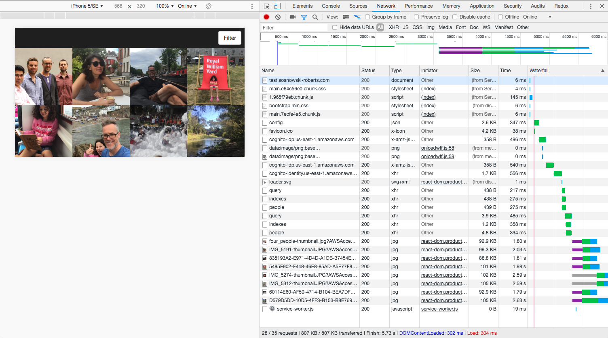

[](https://travis-ci.org/mbudm/fotopia-serverless)

# fotopia-serverless

A photo archive using serverless framework.



## Requires

- Node 8.10.0 (matches AWS Lambda env)
- yarn (or npm)
- serverless framework `yarn global add serverless`
- AWS account with credentials (https://serverless.com/framework/docs/providers/aws/guide/credentials/)
- Java Runtime Engine (JRE) version 6.x or newer (for running dynamodb locally with `serverless-dynamodb-local` plugin)

## Local development

### Run locally
To get an api running at http://localhost:5000 run the following commands:

- `yarn`
- `sls dynamodb install`
- `sls offline start`
- `yarn functional-local` to run functional (api) tests against local

Dev commands
- `yarn lint`
- `yarn test` - unit tests


## CI/CD

For proper deploying - it's best to use CI/CD as you're certain to use the right settings (eg node version) every time. The `.travis.yml` file does the following steps on commit:

- `node serverless.env.js` create env vars for serverless.yml
- `yarn lint`
- `npm install -g serverless`
- `sls dynamodb install`
- `sls offline start --exec "yarn functional-local"` Run functional tests against an offline stack
- `sls deploy -s dev` Deploy to dev stage environment
- `yarn functional-dev` Run functional tests against the dev stage stack
- `sls deploy -s prod` Deploy to prod stage environment

### Required environment vars for deployting or removing via CI/CD

```sh
NAME_SPACE=identifier-to-make-s3-buckets-unique # eg my-identifier which becomes fotopia-web-app-my-identifier-prod
AWS_ACCESS_KEY_ID=<aws access key>
AWS_SECRET_ACCESS_KEY=<aws secret key>
CUSTOM_DOMAIN_DEV=dev-api.yourdomain.com # optional if you don't want to use the serverless-domain-manager plugin
CUSTOM_DOMAIN_PROD=api.yourdomain.com # optional if you don't want to use the serverless-domain-manager plugin
TEST_EXISTING_USER=YourTestUserName
TEST_EXISTING_USER_PWD=Y0urTestP*ssword
FOTOPIA_GROUP=my-group # a string used as dynamodb global index key to allow queries across all users photos. in future this will allow for a simple way to have separate groups in one fotopia instance
LOCAL_TEST_DOMAIN='http://localhost:3000' # for the local functional tests
LOCAL_TEST_BUCKET=fotopia-web-app-<your-name-space>-dev # for the local functional tests
```

If you are setting up a test user for a new stack or a new user each time then, remove `TEST_EXISTING_USER` and use:

```sh
TEST_USER_EMAIL=test-user@yourdomain.com.com
TEST_USER_NAME=YourTestUserName
TEST_USER_TEMP_PWD=TempPwd123!
TEST_USER_PWD=PermPwd456!
```
## Troubleshooting

### Use the AWS Lambda node version

Some modules (Sharp I'm looking at you) don't work in AWS Lambdas unless installed via the exact same Node version. So make sure you are always on v8.10.0 or always rely on your CI tool to deploy.

### Local cleanup

Serverless offline is a mock environment, which sometimes needs a bit of cleaning up.

- remove s3 'bucket', not crucial just avoids the CLI message: `error: [S3rver] Error creating bucket. Bucket "fotopia-web-app-[namespace]-dev" already exists`. To avoid this do these two remove cmds
  `rm -R /tmp/s3Bucket/fotopia-web-app-[namespace]-dev/ && rm -R /tmp/s3Bucket/fotopia-web-app-[namespace]-dev-output/`
- kill node server `killall node` (warning: kills all node scripts)
- kill dynamodb local `lsof -i:8000` then `kill [PID]`
- - or use [kill-port](https://www.npmjs.com/package/kill-port) npm package to simply do `kill-port 8000` (recommended)

### No Java runtime present (OSX High Sierra)

Java is needed by the `serverless-dynamodb-local` plugin. I was getting this message whenever doing `java -version` and no matter how many attempts at updating my .bash_profile nothing worked except for installing the Java JDK.

## Backlog

- Write up some of this fun stuff as articles

  - dev workflow with sls offline (eg peopleThumbs change)
  - dynamodb design with elusive low cost search option and scaling
  - cognito and amplify, performance, simpler alternatives
  - PWAs on iOS and perf improvements (react to preact as sep article?)
  - observability in serverless stack. identify good guids to track esp across dynamodb streams
  - a full rekognition implememntation grouping faces into people efficiently
  - a simple CI and functional testing option for serverless apps
  - an open source google photos alternative that cost $2 per month to host.
  - AWS SAM and Serverless Framework CLI comparison

- tech backlog

  - db backup and migrate script for changes that need a stack rebuild
    - POC done (kinda - a bit hand holdy) with logging stack added post deploy
      - need to also automate somewhere: `aws rekognition delete-collection --profile rekognitionuser --collection-id "collection-id"`
      - ugh really need a node.js api to replicate what amplify does in the client
    - could automate with sls package..
      - if fails then, do backup/remove/deploy/restore
    - separate s3 stack
    - separate or backup/restore users
  - update to aws amplify v1, break up the bundle
    - tried with functional tests and its even less node friendly
    - for func tests and bulk uploader maybe fork and use the best bits?
  - finish bul uploader
  - migrate to preact & mobx
  - keep stack warm/performance tweaking. ec2 comparison test.
  - try out AWS SAM

- Moar features
  - admin. user/family group
  - delete
  - edite meta
  - public share
  - rescan with faces attached to person
