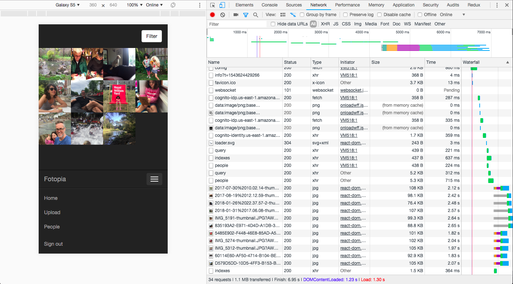

[](https://travis-ci.org/mbudm/fotopia-serverless)

# fotopia-serverless

A photo archive using [serverless framework](https://serverless.com/). This is a work in progress (see [issues](https://github.com/mbudm/fotopia-serverless/issues) for planned enhancements - help welcome!). It's a great app for learning and trying out AWS services and it is useful for managing your own photos.



Currently the fotopia serverless project includes:
- Progressive Web App (PWA) ([Separate repo](https://github.com/mbudm/fotopia-serverless-client))
- All resources defined and deployed using serverless framework Infra as Code
- AWS Cognito for auth
- DynamoDb for storage
- AWS Lambda & API gateway for API
- AWS Rekognition for detecting people and tags in photos
- CloudFront distributions for API and PWA SPA
- Custom Domains using Route 53
- Bulk uploader ([separate repo](https://github.com/mbudm/fotopia))

## Requires

- Node 8.10.0 (matches AWS Lambda env)
- yarn (or npm)
- serverless framework `yarn global add serverless`
- AWS account with credentials (https://serverless.com/framework/docs/providers/aws/guide/credentials/)

## Deploy

You can deploy from your computer using the serverless CLI. However I recommend using CI/CD (See next section).

- `yarn`
- `sls deploy`

I'm currently having an issue with deploying from dev machines. Even when I use the exact Lambda node version - 8.10.0 - the Sharp module doesn't build correctly and the thumbs lambdas fail. When deploying via CI/CD which uses ubuntu, there is no issue.

## CI/CD

For proper deploying - it's best to use CI/CD as you're certain to use the right settings (eg node version) every time. The `.travis.yml` file does the following steps on commit:

- `yarn lint`
- `yarn test`
- `npm install -g serverless`
- `sls deploy -s dev` Deploy to dev stage environment
- `yarn functional-dev` Run functional tests against the dev stage stack
- `sls deploy -s prod` Deploy to prod stage environment

### Removing, using 'alpha' stage
Sometimes you need to remove your stack and start again. If you are using the `travis.yml` spec this is as easy as adding 'redeploy' to your commit message or travis-ci trigger.

`travis.yml` uses conditionals to pick up branch and commit info and decide what build to run. I use an alpha branch to try out experimental stuff.

### Required environment vars for deploying or removing via CI/CD

```sh
NAME_SPACE=identifier-to-make-s3-buckets-unique # eg my-identifier which becomes fotopia-web-app-my-identifier-prod
AWS_ACCESS_KEY_ID=<aws access key>
AWS_SECRET_ACCESS_KEY=<aws secret key>
CUSTOM_DOMAIN_DEV=dev-api.yourdomain.com # optional if you don't want to use the serverless-domain-manager plugin
CUSTOM_DOMAIN_PROD=api.yourdomain.com # optional if you don't want to use the serverless-domain-manager plugin
TEST_USER_NAME=YourTestUserName
TEST_USER_PWD=Y0urTestP*ssword
FOTOPIA_GROUP=my-group # a string used as dynamodb global index key to allow queries across all users photos. in future this will allow for a simple way to have separate groups in one fotopia instance
```

If you are setting up a test user for a new stack or a new user each time then, remove `TEST_EXISTING_USER` and use:

```sh
TEST_USER_EMAIL=test-user@yourdomain.com.com
TEST_USER_NAME=YourTestUserName
TEST_USER_TEMP_PWD=TempPwd123!
TEST_USER_PWD=PermPwd456!
```

## Local development

Local mocking of AWS services is fraught. I've stopped doing it as the upkeep is not worth the value I get. I prefer to deploy straight to cloud after thorough TDD locally.

## Dev commands

- `yarn lint`
- `yarn test` - unit tests
- `yarn test-watch` - unit tests watcher
- Run single unit test, `npx tape -r ts-node/register -r babel-register './fotos/delete__test__.ts' | npx tap-spec` (need to globally install npx)

## Troubleshooting

Things will go wrong - with AWS services pretty much everything can be configured so there are a lot of moving parts. Guiding principles are:

- if something suddenly isnt working it's always user error
- use CI/CD as relying on doing all the steps in the right order is not a good human skill
- check the AWS console and see what your cloudformation stack has done, what resources have been set up. Read logs or better still use an observability tool like Honeycomb (separate Honeycomb setup is included in /logging).
- Search for help, there are heaps of discussions at serverless forums and on stack overflow
- If you're stumped the problem is quite possibly not where you think it is. E.g
- - For a while I thought that disabling custom domain was the reason my alpha stage was returning 403 errors on fetching s3 objects. No it was because I was deploying locally and had the wrong node version, which meant the sharp library didnt compile, meaning the thumbs Lambda wasnt producing the thumbnail
- - The thumbnail creation for people, using the AWS Rekognition API was missing faces and cropping incorrectly. Turns out this was not an error in my peopleThumbs AWS Lambda as I thought but was because I wasn't taking into account the EXIF orientation of the images.

### Use the AWS Lambda node version

Some modules (Sharp I'm looking at you) don't work in AWS Lambdas unless installed via the exact same Node version. So make sure you are always on v8.10.0 or always rely on your CI tool to deploy.

# Contributing

Yes! Do it.

Dev setup:
- use tslint
- editorconfig
- unit tests are awesome
- functional tests are superb
